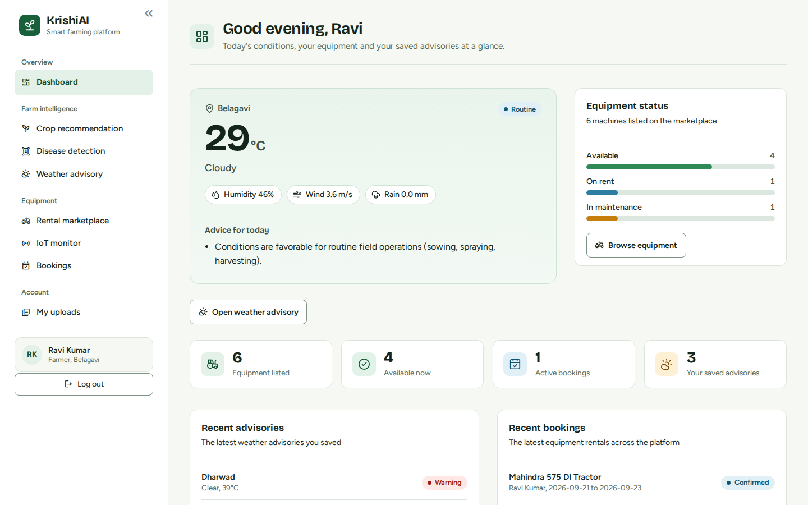
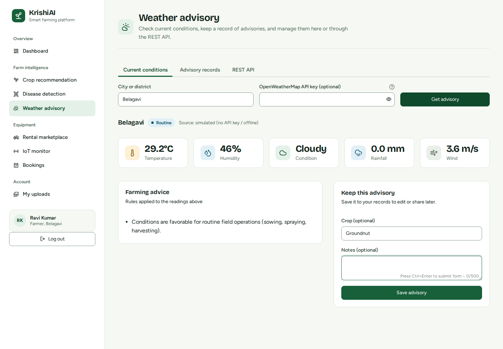
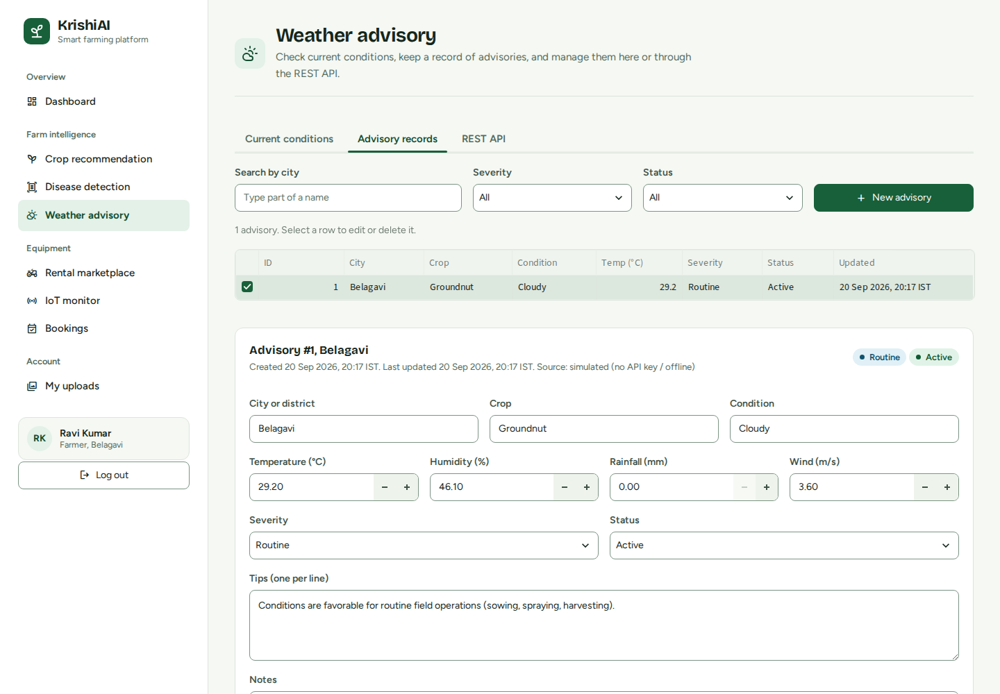
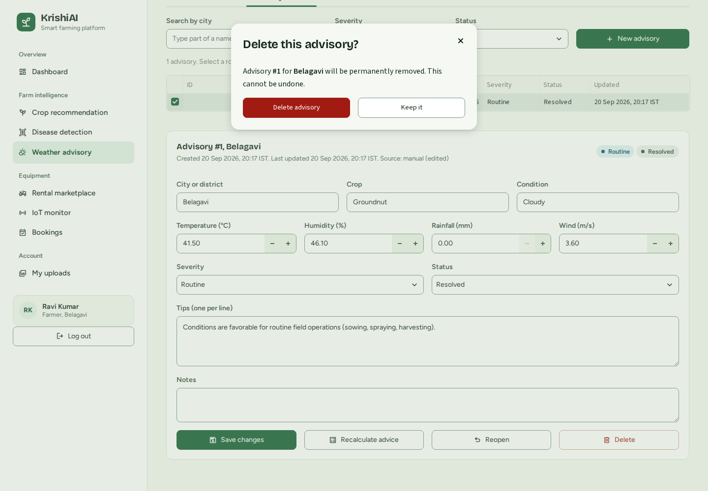
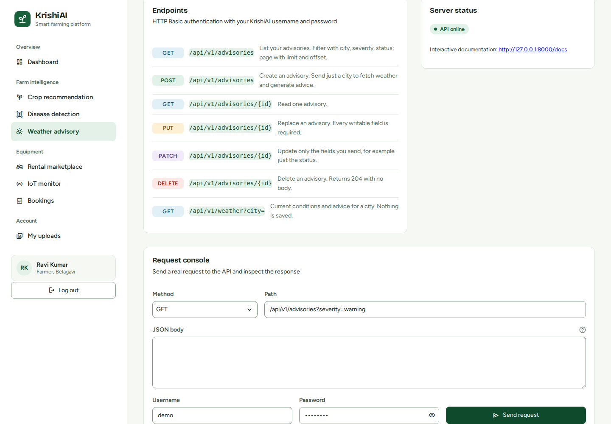

# KrishiAI: AI & IoT Powered Smart Agricultural Equipment Rental System

Major project,(BCS685), EWIT, 2025-26.

KrishiAI is a Streamlit web application with a companion REST API. It combines crop recommendation, leaf
disease screening, weather advisories and an equipment rental marketplace with simulated IoT telemetry.



## What is new in this version

| Area | Change |
|---|---|
| **Weather Advisory REST API** | New FastAPI service with **POST, GET, PUT, PATCH and DELETE** for weather advisories, HTTP Basic auth, validation, pagination, and interactive Swagger docs. |
| **Weather Advisory page** | Full create / read / update / delete screens in the web app, plus a live **request console** that calls the REST API. |
| **Interface** | Complete redesign: light theme, grouped sidebar navigation, consistent components, bundled fonts (works offline), no emoji. |
| **Colour contrast** | Every text colour meets WCAG 2.1 AA. Verified by a palette checker and by measuring 1,101 rendered text elements across 22 screens/states (0 failures). |
| **Tests** | 21 automated API tests (`pytest`). |
| **Bug fixes** | See [Bug fixes](#bug-fixes). |

## Quick start

Requires Python 3.9 or newer (developed and tested on Python 3.12 with Streamlit 1.64).

```bash
python -m venv venv
source venv/bin/activate          # Windows: venv\Scripts\activate
pip install -r requirements.txt
python run.py
```

`run.py` starts both servers:

- Web app: <http://localhost:8501>
- REST API: <http://127.0.0.1:8000>, interactive docs at <http://127.0.0.1:8000/docs>

To start them separately instead (two terminals, both from the project folder):

```bash
streamlit run src/app.py                      # web app
cd src && uvicorn api:app --port 8000         # REST API
```

> Always start Streamlit from the **project folder** (`streamlit run src/app.py`), not from inside `src/`.
> The bundled fonts and theme are read from `.streamlit/config.toml` in the project folder.

On first launch, create an account on the **Create account** tab, or load ready-made demo data:

```bash
python tools/seed_demo.py         # creates user  demo / demo1234  with sample advisories
```

The first launch also trains the crop model, which takes a few seconds.

## Weather Advisory REST API

An *advisory* is a saved snapshot of weather readings for a place, with a severity (`info`, `watch`, `warning`), a
status (`active`, `resolved`) and rule-based farming tips.

Base URL `http://127.0.0.1:8000/api/v1`. Authentication is **HTTP Basic** using your KrishiAI username and
password. Each user only sees and changes their own advisories.

| Method | Path | Purpose | Success |
|---|---|---|---|
| `GET` | `/advisories` | List. Filters: `city`, `severity`, `status`. Paging: `limit`, `offset` | 200 |
| `POST` | `/advisories` | **Create.** Send only `city` to auto-fetch weather and generate tips | 201 + `Location` header |
| `GET` | `/advisories/{id}` | Read one | 200 |
| `PUT` | `/advisories/{id}` | **Replace** every writable field | 200 |
| `PATCH` | `/advisories/{id}` | **Update** only the fields you send | 200 |
| `DELETE` | `/advisories/{id}` | **Delete** | 204, no body |
| `GET` | `/weather?city=` | Current conditions and advice (nothing saved) | 200 |
| `GET` | `/health` | Service status (no auth) | 200 |

Errors: `401` bad credentials, `404` not found (also returned for another user's record), `422` invalid body
(the response names the field and the problem).

### Examples

```bash
# Create: only a city is needed, the server fetches the weather and writes the tips
curl -X POST http://127.0.0.1:8000/api/v1/advisories -u demo:demo1234 \
  -H "Content-Type: application/json" \
  -d '{"city": "Belagavi", "crop": "Sugarcane"}'

# Create with your own readings
curl -X POST http://127.0.0.1:8000/api/v1/advisories -u demo:demo1234 \
  -H "Content-Type: application/json" \
  -d '{"city": "Hubballi", "temperature": 27.5, "humidity": 84, "condition": "Light Rain", "rainfall_mm": 7.2}'

# Read
curl http://127.0.0.1:8000/api/v1/advisories -u demo:demo1234
curl "http://127.0.0.1:8000/api/v1/advisories?severity=warning&limit=10" -u demo:demo1234
curl http://127.0.0.1:8000/api/v1/advisories/1 -u demo:demo1234

# Update some fields (PATCH)
curl -X PATCH http://127.0.0.1:8000/api/v1/advisories/1 -u demo:demo1234 \
  -H "Content-Type: application/json" -d '{"status": "resolved"}'

# Replace everything (PUT) - all writable fields are required
curl -X PUT http://127.0.0.1:8000/api/v1/advisories/1 -u demo:demo1234 \
  -H "Content-Type: application/json" \
  -d '{"city": "Belagavi", "temperature": 31, "humidity": 48, "condition": "Clear",
       "severity": "info", "status": "active", "tips": ["Good day for spraying."]}'

# Delete
curl -X DELETE http://127.0.0.1:8000/api/v1/advisories/1 -u demo:demo1234
```

Notes for the report:

- **PUT vs PATCH.** PUT replaces the whole record (optional fields you leave out, such as `crop` and `notes`, are cleared).
  PATCH changes only what you send; send `null` for `crop` or `notes` to clear them.
- **Validation** lives in one place, `src/schemas.py` (Pydantic), and is used by both the API and the web forms.
  Temperature must be -50 to 60 &deg;C, humidity 0 to 100 %, and so on. Unknown fields are rejected.
- **Layers.** `api.py` (HTTP) and `views/weather.py` (web page) both call `advisory_service.py` (business rules),
  which calls `database.py` (SQL). Every query is filtered by user id, so ownership is enforced in one place.
- **Source label.** If you edit the readings of an advisory that was fetched from a weather service, its source
  changes to `manual (edited)` so the record never claims data it no longer contains.

### Using it from the web app

**Weather advisory** in the sidebar has three tabs:

1. **Current conditions**: look up a place, read the advice, and save it (POST).
2. **Advisory records**: filter the list, select a row, then edit and **Save changes** (PUT), **Mark resolved /
   Reopen** (PATCH) or **Delete** (DELETE, with a confirmation). **New advisory** creates one (POST).
3. **REST API**: endpoint reference, server status, and a **request console** that sends real HTTP requests to the
   running API and shows the status code and JSON response, together with the equivalent `curl` command.

| | |
|---|---|
|  |  |
|  |  |

## Tests

```bash
pip install -r requirements-dev.txt
pytest -v
```

The 21 tests use a throw-away database and cover: authentication (including that wrong-password and unknown-user
responses are identical), every method and status code, PUT vs PATCH semantics, validation failures, filtering
and paging, and that one user cannot read, change or delete another user's advisories.

## Design and accessibility

- **Light theme.** Canopy green (`#17603A`) for actions on a faintly green-tinted white (`#F5F8F3`). Blue marks
  information, amber marks warnings, and red is used only for errors and destructive actions.
- **Type.** Bricolage Grotesque for headings, Figtree for everything else. Both are bundled in `src/static/fonts`
  (SIL Open Font License), so the app looks identical without internet access.
- **Contrast.** Body text is 15.9:1 on white and every text pair is at least 4.97:1 (the weakest is placeholder text);
  the minimum for WCAG AA is 4.5:1. Input borders and focus rings meet the 3:1 rule for interface components.
  Re-check after changing any colour with `python tools/check_contrast.py`.
- **Keyboard and motion.** Visible focus outlines on every control; animations are disabled for users who
  request reduced motion.
- All styling is in `src/static/krishiai.css`. Colours are the variables at the top of that file.

## Project structure

```
krishi_ai/
├── run.py                       starts the web app and the REST API together
├── requirements.txt             runtime dependencies
├── requirements-dev.txt         adds pytest and httpx
├── .streamlit/config.toml       theme + bundled-font serving
├── data/                        created at runtime: SQLite DB, trained model, uploaded leaf photos
├── docs/screenshots/
├── tests/                       pytest suite for the REST API
├── tools/
│   ├── check_contrast.py        WCAG check of the colour palette
│   └── seed_demo.py             demo account and sample data
└── src/
    ├── app.py                   entry point: login gate, sidebar, navigation
    ├── api.py                   REST API (FastAPI)
    ├── schemas.py               request/response models and validation rules
    ├── advisory_service.py      advisory business logic (shared by API and web app)
    ├── database.py              SQLite schema and queries
    ├── auth.py                  PBKDF2-HMAC-SHA256 password hashing, signup and login
    ├── weather_service.py       weather lookup (OpenWeatherMap or simulated) and advice rules
    ├── crop_recommendation.py   RandomForest crop model
    ├── disease_detection.py     leaf colour analysis
    ├── iot_simulator.py         simulated sensor telemetry
    ├── theme.py, ui.py, icons.py, nav.py    interface helpers
    ├── static/                  krishiai.css, fonts, favicon
    └── views/                   one module per page
```

## Scope notes (for your viva)

This is a working prototype. Three parts use clearly documented stand-ins where the full version needs resources a
laptop project doesn't have; each source file explains what to swap in.

- **Crop data** is a synthetic but agronomically plausible dataset generated in `crop_recommendation.py`. For the
  final submission, download the real Kaggle *Crop Recommendation Dataset* and point `train_model()` at it.
- **Disease detection** is a colour-ratio heuristic, not a trained CNN. `disease_detection.py` describes how to swap
  in a MobileNetV2 model trained on PlantVillage with the same function signature.
- **IoT readings** are simulated. Replace `generate_reading()` in `iot_simulator.py` with real MQTT or serial reads.
- **Weather** is simulated unless you supply a free OpenWeatherMap key (in the page, or as the
  `OPENWEATHER_API_KEY` environment variable). The source of every reading is shown in the interface.
- The IoT **map** loads its tiles from the internet, so it is blank when offline. The coordinates are still shown.

## Bug fixes

Found while reviewing the original code:

1. **Completing a booking never completed it.** The old button only made the machine available again; the booking
   stayed `confirmed` forever and kept counting as active. It now marks the booking `completed` and frees the machine.
2. **Duplicate uploads.** Disease Detection re-saved the same photo (and re-logged it) on every Streamlit rerun, so
   any interaction created another entry in *My Uploads*. Each photo is now saved once.
3. **Confirmation messages never appeared** (`st.success` followed immediately by `st.rerun`). They now show as toasts.
4. **Login messages revealed which usernames exist.** Wrong username and wrong password now give the same message.
5. **Wind speed was collected but never used** in the advisory rules. Strong wind now produces a spraying warning.
6. **A failed live weather lookup was labelled "no API key".** The source label now says the lookup failed.

## Upgrading from an older copy

Existing databases keep working: the new `weather_advisories` table is created automatically. If your copy predates
authentication (no `users` table), delete `data/krishiai.db` once so the current schema is created.

## Troubleshooting

- **Fonts look generic / plain.** Streamlit was started from inside `src/`. Start it from the project folder with
  `streamlit run src/app.py`, or use `python run.py`.
- **"API offline" on the REST API tab.** The API server isn't running. Use `python run.py`, or start `uvicorn` as shown above.
- **Port already in use.** `python run.py --app-port 8502 --api-port 8001`.
# Deployment link: ** 